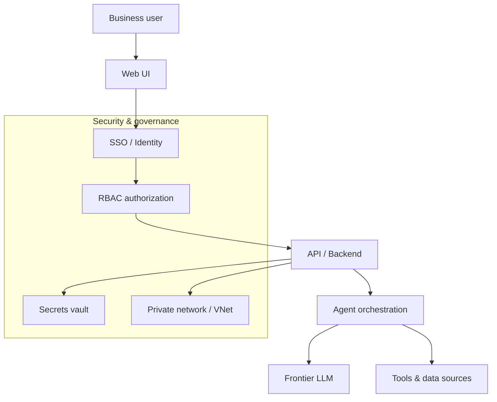

# AI Product Portfolio — Alex Martinez

Genericized case studies of AI and automation products I've led from idea to production. Company-specific names, codenames, and internal figures are intentionally omitted — this focuses on the product thinking, the decisions, and the outcomes.

> **Role across all of these:** Product Owner / Product Manager — I define the *what* and *why*, and partner with engineers, RPA specialists, and AI practitioners on the *how*.

---

## 1. Enterprise AI Application (agentic, in production)
**Problem:** A business team needed an AI-powered internal application, but it had to clear enterprise security before it could ever ship.
**What I did:** Owned the product from architecture through launch — drove decisions on SSO, role-based access control, a secrets vault, and network isolation; orchestrated AI agents with an automation framework; and partnered with cybersecurity through formal architecture review.
**Outcome:** Shipped to production with security and governance sign-off.
**PM lesson:** For enterprise AI, the model is the easy part — access, data boundaries, and review gates are what actually decide whether you ship.

**Architecture (genericized):**

See **[docs/](docs/)** for the full architecture write-up, a build-vs-buy decision record, and a sample PRD.

## 2. Frontier Model Evaluation & AI Tooling Strategy
**Problem:** Leadership needed to know which AI models and tools to bet on, and where AI beats traditional automation.
**What I did:** Evaluated frontier models and agentic frameworks (incl. Claude and Copilot) for ROI, integration fit, and deployment readiness. Built the framing for *build vs. buy* and set a roadmap for scaling AI beyond RPA.
**Outcome:** A clear, defensible adoption roadmap.
**PM lesson:** Evaluation is a product skill. Golden sets, offline-vs-online testing, and an honest view of failure modes matter more than benchmark scores.

## 3. AI Industry-Intelligence / Sales-Content Agent
**Problem:** A team spent enormous manual effort assembling competitive and sales content.
**What I did:** Ran discovery and sized the opportunity, scoping an AI agent to aggregate and generate the content.
**Outcome:** Estimated **~2,000 hours/year saved** and a six-figure annual value, validated for prioritization.
**PM lesson:** Quantify the prize before you build. A credible, conservative estimate is what gets an idea funded.

## 4. Internal LLM Assistant (0 → 1 MVP)
**Problem:** Engineers lost time on repetitive issue-tracking and lookup tasks.
**What I did:** Shipped an MVP LLM assistant, demoed it, and ran a feedback loop to decide what to harden.
**Outcome:** A working prototype that proved the workflow value before heavier investment.
**PM lesson:** Ship the smallest thing that creates a real conversation. Demos beat decks.

## 5. Executive Analytics & Dashboards
**Problem:** Leadership lacked a clear, current view of portfolio health and adoption.
**What I did:** Modernized KPI and adoption dashboards used in leadership readouts; automated the reporting behind them.
**Outcome:** Faster, self-serve executive visibility.
**PM lesson:** A dashboard is a product. Design it for the decision it's meant to drive.

---

## How I evaluate AI features before shipping
- **Golden set** of representative cases; track precision/recall, not a single accuracy number.
- **LLM-as-judge vs. human raters vs. rubrics** — rubrics + humans for high-stakes, LLM-as-judge for scale with spot-checks.
- **Offline → online** — fixed-set eval before ship; canary/shadow/A-B in production.
- **Failure handling** — grounding, guardrails, confidence thresholds, rollback, and a postmortem that adds a new eval test.
- **The three you always trade:** quality ↔ latency ↔ cost.

## PM artifacts (how I work)
- 📐 **[Architecture write-up](docs/architecture.md)** — system + agentic flow diagrams (Mermaid)
- 🧭 **[Decision record: build vs. buy](docs/decision-record-build-vs-buy.md)** — how I framed a model/search decision
- 📋 **[Sample PRD (one-pager)](docs/prd-one-pager.md)** — problem, goals, metrics, risks, milestones

## Stack
Agentic AI & LLMs · RPA · Microsoft Power Platform (Power Automate, Power BI, Dynamics) · SQL · Python · Agile/Scrum

## Connect
[LinkedIn](https://www.linkedin.com/in/alexis-martinez-g)
