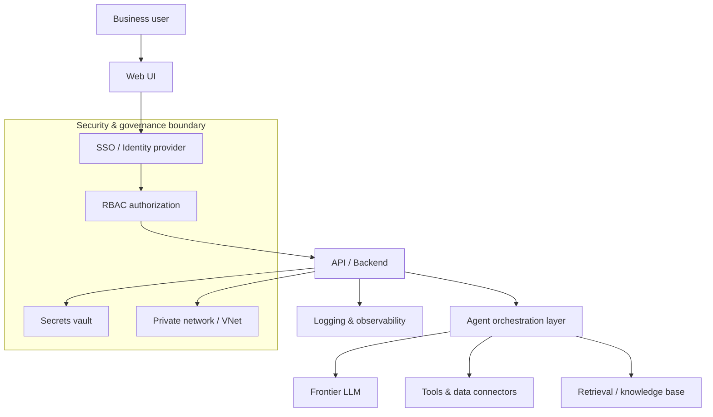
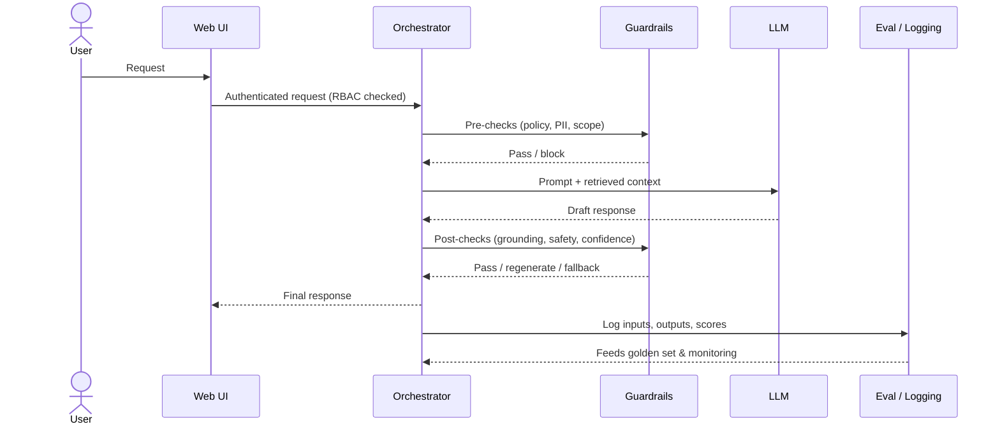

# Architecture Write-up (genericized)

How I think about the architecture of an enterprise, agentic AI application. Company-specific details are omitted; the point is the decisions and the reasoning.

## System architecture

**Why it's shaped this way**
- **Identity and RBAC first.** In an enterprise, "who can see what" is a product requirement, not an afterthought. Access decisions gate the whole experience.
- **Orchestration layer between the API and the model.** Keeps the model swappable (build-vs-buy stays open), centralizes tool use, and is where guardrails and evals live.
- **Secrets vault + private networking.** Non-negotiable for security review; designing for them up front is what let the app actually ship.
- **Observability everywhere.** You can't evaluate or roll back what you can't see.

## Request + guardrail flow

**What this buys the product**
- A bad model answer is *caught* (post-checks, confidence thresholds, fallback) instead of shipped to the user.
- Every interaction feeds the eval set and monitoring, so quality is measured over time — not assumed.
- Swapping or upgrading the model is a contained change, because the orchestrator owns tools, guardrails, and evals.
